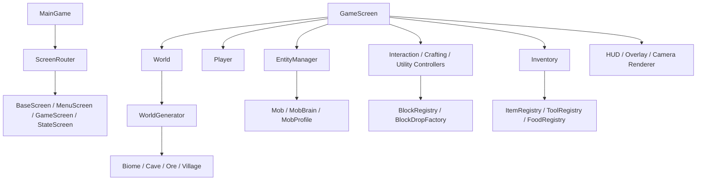

# BÁO CÁO BÀI TẬP LỚN LẬP TRÌNH HƯỚNG ĐỐI TƯỢNG

## Đề tài: Minecraft 2D

### Thông tin chung

- Học phần: Lập trình hướng đối tượng
- Tên đề tài: Xây dựng game Minecraft 2D
- Ngôn ngữ lập trình: Java
- Framework/thư viện: libGDX, LWJGL3, Gradle
- Nhóm thực hiện: [Điền tên thành viên]
- Giảng viên hướng dẫn: [Điền tên giảng viên]
- Thời gian thực hiện: [Điền thời gian]

---

## 1. Mở đầu

### 1.1. Lý do chọn đề tài

Minecraft là một trò chơi sandbox có nhiều cơ chế lập trình phù hợp với môn Lập trình hướng đối tượng, bao gồm thế giới được cấu thành từ block, người chơi, quái vật, vật phẩm, túi đồ, chế tạo, chiến đấu và các màn hình giao diện. Khi xây dựng phiên bản Minecraft 2D, nhóm có thể áp dụng rõ các khái niệm như đóng gói, kế thừa, đa hình, trừu tượng hóa, quản lý trạng thái và tách trách nhiệm giữa các lớp.

Đề tài này không chỉ yêu cầu hiển thị đồ họa mà còn cần thiết kế nhiều hệ thống gameplay độc lập: sinh thế giới, vật lý, tương tác block, inventory, mob AI, crafting, furnace, chest, raid, trading, audio và điều hướng màn hình. Vì vậy, đây là bài toán phù hợp để chứng minh khả năng phân tích, thiết kế và cài đặt phần mềm theo hướng đối tượng.

### 1.2. Mục tiêu đề tài

- Xây dựng một game 2D lấy cảm hứng từ Minecraft, có thể chạy trên desktop.
- Áp dụng các nguyên lý OOP để thiết kế hệ thống có khả năng mở rộng.
- Cài đặt thế giới hữu hạn có biome, cave, ore và village.
- Cài đặt người chơi, vật lý, va chạm, đào block, đặt block và chiến đấu.
- Cài đặt inventory, crafting, furnace, chest, food, tool, armor và dropped item.
- Cài đặt mob passive/hostile, có AI cơ bản và cơ chế spawn theo biome/ngày đêm.
- Cài đặt các màn hình game: loading, menu, mode select, game, pause, game over, settings và help.
- Cài đặt âm thanh, nhạc nền, jukebox và một số hiệu ứng SFX.
- Viết unit test cho các thành phần logic quan trọng.

### 1.3. Phạm vi đề tài

Do thời gian của bài tập lớn có hạn, đề tài tập trung vào phiên bản desktop với thế giới 2D hữu hạn. Game chưa hướng đến multiplayer, save/load đầy đủ, hệ thống XP, potion effect và một số tính năng nâng cao khác của Minecraft gốc.

---

## 2. Công nghệ sử dụng

### 2.1. Java

Java được sử dụng làm ngôn ngữ lập trình chính. Java phù hợp với môn OOP vì hỗ trợ lớp, đối tượng, kế thừa, interface, enum, access modifier, package và cơ chế quản lý bộ nhớ tự động.

### 2.2. libGDX

libGDX là framework phát triển game đa nền tảng. Trong dự án này, libGDX được dùng để:

- Tạo vòng lặp game thông qua `Game` và `Screen`.
- Vẽ sprite bằng `SpriteBatch`.
- Xử lý input bàn phím/chuột.
- Quản lý camera, viewport, texture và audio.
- Tổ chức ứng dụng desktop thông qua module LWJGL3.

### 2.3. Gradle và LWJGL3

Gradle được dùng để quản lý build, dependency và test. Module `core` chứa logic game dùng chung, module `lwjgl3` là launcher desktop.

Một số lệnh kiểm thử/chạy chương trình:

```powershell
.\gradlew.bat --no-daemon classes
.\gradlew.bat --no-daemon test
.\gradlew.bat --no-daemon lwjgl3:run
```

---

## 3. Phân tích yêu cầu

### 3.1. Yêu cầu chức năng

Game đã cài đặt các nhóm chức năng chính sau:

1. Màn hình và điều hướng
   - Loading screen, menu, mode select, game screen, pause, game over, settings và help.
   - Điều hướng màn hình thông qua `ScreenRouter`.

2. Thế giới và sinh địa hình
   - Thế giới hữu hạn với kích thước 500 x 128 tile.
   - Chia thế giới thành chunk để lưu trữ và render.
   - Sinh biome forest, plains, desert, snow và cherry.
   - Sinh cây, thực vật, village, cave, ore và deepslate.

3. Người chơi và vật lý
   - Di chuyển trái/phải, nhảy, rơi, va chạm với block.
   - Camera theo người chơi và bị giới hạn trong biên thế giới.
   - Sinh điểm spawn an toàn để tránh kẹt trong block.

4. Block interaction
   - Đào block bằng chuột trái.
   - Hiển thị con trỏ block và crack overlay khi đào.
   - Đặt block bằng chuột phải.
   - Block có độ cứng, đồ rơi, harvest rule và solidity riêng.

5. Inventory, item và crafting
   - Hotbar 9 slot và main inventory.
   - Kéo thả, swap, tách stack, gộp stack.
   - Crafting table, furnace, chest và jukebox.
   - Tool, armor, food, music disc và item drop.

6. Mob, combat và raid
   - Mob passive, hostile và villager.
   - AI có patrol, chase, attack, panic, line-of-sight.
   - Player có thể tấn công melee.
   - Raid gồm nhiều wave với pillager, vindicator, evoker, ravager và vex.

7. Trading và village
   - Village sinh trong vùng plains phẳng.
   - Villager có profession và danh sách offer.
   - Giao dịch bằng emerald và item.

8. Ngày đêm và spawn theo biome
   - Chu kỳ ngày đêm runtime.
   - Hostile spawn phụ thuộc biome và thời điểm ban đêm.

9. Âm thanh
   - Nhạc menu, nhạc gameplay, nhạc raid.
   - SFX cho UI, block, combat, item pickup, chest, furnace, door và jukebox.

### 3.2. Yêu cầu phi chức năng

- Code được chia package theo từng hệ thống để dễ bảo trì.
- Các lớp tích hợp lớn như `GameScreen` chỉ nên gọi API ngắn của các controller/manager.
- Logic quan trọng có unit test.
- Tài nguyên dùng chung như `SpriteBatch`, `AssetManager`, `AudioManager` được quản lý tập trung.
- Chuyển màn hình thông qua router để tránh lỗi lifecycle.
- Nếu asset thiếu, hệ thống cần fallback an toàn thay vì crash.

---

## 4. Thiết kế tổng quan

### 4.1. Cấu trúc module

Dự án gồm hai module chính:

- `core`: chứa toàn bộ logic game, class entity, world, UI, interaction, inventory, audio và test.
- `lwjgl3`: chứa launcher desktop và cấu hình chạy trên máy tính.

### 4.2. Cấu trúc package chính

| Package | Vai trò |
| --- | --- |
| `com.main.game` | Lớp khởi động, trạng thái game dùng chung |
| `screens` | Các màn hình và vòng đời screen |
| `navigation` | Điều hướng/chuyển màn hình |
| `world`, `worldgen` | Lưu trữ thế giới và sinh địa hình |
| `blocks` | Lớp block và metadata block |
| `entities` | Entity, player, mob và entity manager |
| `physics` | Vật lý và va chạm |
| `interaction` | Đào block, đặt block, overlay |
| `inventory` | Túi đồ, item stack, item registry, tool/food/armor |
| `crafting` | Công thức và xử lý crafting |
| `utilityblock` | Crafting table, furnace, chest, door, jukebox |
| `combat` | Tấn công, sát thương, drop khi mob chết |
| `raid` | Điều khiển raid và spawn mob raid |
| `trading` | Giao dịch với villager |
| `projectile`, `evoker` | Đạn bay, phép evoker và vex |
| `time` | Chu kỳ ngày đêm |
| `audio` | Quản lý âm thanh và nhạc |
| `ui` | HUD, overlay, camera và UI renderer |

### 4.3. Sơ đồ kiến trúc mức cao



---

## 5. Thiết kế lớp và áp dụng OOP

### 5.1. Đóng gói

Đóng gói được thể hiện qua việc mỗi hệ thống có package và lớp riêng:

- `Inventory` chỉ quản lý dữ liệu slot, stack và armor.
- `InventoryRenderer` chỉ phụ trách vẽ giao diện inventory.
- `InventoryInteractionHandler` xử lý click và tương tác slot.
- `BlockRegistry` lưu metadata block thay vì rải logic block ở nhiều nơi.
- `FurnaceManager`, `FurnaceRenderer`, `FurnaceInteractionHandler` tách riêng dữ liệu, render và input của furnace.

Việc đóng gói giúp giảm phụ thuộc trực tiếp giữa các hệ thống, làm code dễ kiểm thử và dễ mở rộng.

### 5.2. Kế thừa

Một số ví dụ kế thừa trong dự án:

- `MainGame extends Game`: sử dụng vòng đời của libGDX.
- `BaseScreen implements Screen`: lớp cơ sở cho các màn hình.
- `GameScreen`, `MenuScreen`, `LoadingScreen`, `SettingsScreen`, `StateScreen`, `HelpScreen` kế thừa `BaseScreen`.
- `Entity` là lớp trừu tượng cho các đối tượng trong game.
- `Player` và `Mob` phát triển từ mô hình entity có position, velocity, bounds và lifecycle.
- Các block cụ thể kế thừa từ `AbstractBlock`.

Kế thừa giúp dùng chung những thuộc tính và hành vi nền, đồng thời cho phép mỗi lớp con cài đặt logic riêng.

### 5.3. Đa hình

Đa hình được thể hiện qua:

- Các screen cùng tuân theo interface `Screen`, nên `MainGame` có thể chuyển đổi giữa các screen bằng cùng một kiểu dữ liệu.
- Các entity có hàm `update()` và `render()`, cho phép entity manager cập nhật/vẽ nhiều loại đối tượng theo cùng một giao diện.
- Các listener như `MobHitListener`, `MobDeathListener`, `BlockBreakListener`, `BlockPlacementListener`, `VexSummonListener` cho phép controller gọi callback mà không phụ thuộc lớp cụ thể.
- Enum và registry như `MobType`, `ToolType`, `ToolMaterial`, `ScreenId`, `RaidState` giúp xử lý nhiều trạng thái/loại đối tượng có hệ thống.

### 5.4. Trừu tượng hóa

Trừu tượng hóa được áp dụng để ẩn chi tiết phức tạp:

- `ScreenRouter` ẩn chi tiết chuyển screen an toàn.
- `WorldGenerator` ẩn chi tiết sinh biome, cave, ore và village.
- `PhysicsEngine` ẩn chi tiết tính toán gravity và va chạm.
- `AudioManager` ẩn chi tiết load/play/stop âm thanh.
- `ItemSlotInteractionController` ẩn chi tiết thao tác click slot để inventory, crafting, furnace, chest có thể dùng chung.
- `ToolRegistry`, `FoodRegistry`, `ArmorRegistry`, `MusicDiscRegistry` cung cấp API metadata thay vì hard-code ở UI và gameplay.

### 5.5. Nguyên lý tách trách nhiệm

Dự án có nhiều lớp theo vai trò controller/manager/renderer:

- Controller: xử lý input và luồng nghiệp vụ. Ví dụ `BlockPlacementController`, `TradingController`, `RaidController`.
- Manager: quản lý tập đối tượng/trạng thái. Ví dụ `EntityManager`, `DroppedItemManager`, `ChestManager`, `FurnaceManager`.
- Renderer: chỉ phụ trách vẽ. Ví dụ `InventoryRenderer`, `TradingRenderer`, `RaidHudRenderer`, `MobRenderer`.
- Registry: lưu metadata và quy tắc. Ví dụ `BlockRegistry`, `ItemRegistry`, `ToolRegistry`.

Cách chia này giúp mỗi lớp có trách nhiệm rõ, tránh tình trạng một lớp duy nhất xử lý quá nhiều việc.

---

## 6. Mô tả các hệ thống chính

### 6.1. Hệ thống màn hình

`MainGame` tạo tài nguyên dùng chung gồm `SpriteBatch`, `AssetManager`, `ScreenRouter`, `GameState` và `AudioManager`. Khi cần chuyển màn hình, game không gọi `setScreen()` trực tiếp từ gameplay module mà gửi yêu cầu qua `ScreenRouter`.

Lợi ích:

- Tránh chuyển screen giữa lúc đang update/render.
- Dễ quản lý lifecycle `show`, `render`, `hide`, `dispose`.
- Các screen không cần tự tạo tài nguyên dùng chung.

### 6.2. Hệ thống world và world generation

`World` lưu trữ block trong thế giới hữu hạn. Thế giới có kích thước 500 x 128 tile và được chia chunk để tối ưu render/lưu trữ. `WorldGenerator` sinh terrain dựa trên seed, biome và các module con.

World generation gồm:

- Biome forest, plains, desert, snow, cherry.
- Lớp surface, filler và deep layer.
- Cây và thực vật theo biome.
- Cave và ore dưới lòng đất.
- Deepslate và bedrock.
- Village ở vùng plains phẳng.
- Spawn safety cho player và mob.

### 6.3. Hệ thống player và physics

`Player` đại diện cho người chơi, có tọa độ, vận tốc, kích thước, hướng nhìn, máu, trạng thái sống/chết và hunger. `PhysicsEngine` tính toán trọng lực, rơi, nhảy và va chạm theo trục X/Y với block.

Trong gameplay, player có thể:

- Di chuyển trái/phải.
- Nhảy và rơi theo gravity.
- Đào/đặt block.
- Tấn công mob.
- Ăn food để hồi hunger.
- Mặc armor và sử dụng tool.
- Respawn khi chết.

### 6.4. Hệ thống block

Block được định nghĩa bởi lớp block và metadata. `BlockRegistry` tập trung các thông tin:

- Texture.
- Độ cứng.
- Có solid hay không.
- Có thể phá/đặt hay không.
- Item rơi ra khi phá.
- Harvest level.
- Có phải ore hay không.

Cách này giúp khi thêm block mới, lập trình viên có thể đăng ký metadata thay vì sửa nhiều if-chain.

### 6.5. Hệ thống inventory và item

Inventory gồm hotbar 9 slot và main inventory. Item được lưu bằng `ItemStack`, có item id, số lượng và durability nếu là tool/armor.

Chức năng inventory:

- Pick/place/swap item bằng chuột.
- Gộp stack và tách stack.
- Render icon, count và durability bar.
- Hỗ trợ item block, tool, armor, food và music disc.

`ItemSlotRenderer` và `ItemSlotInteractionController` được dùng chung cho inventory, crafting, furnace và chest, thể hiện việc tái sử dụng code theo OOP.

### 6.6. Hệ thống crafting, furnace, chest và jukebox

Crafting:

- Có recipe registry.
- Crafting table mở giao diện crafting.
- Công thức như furnace/chest được hỗ trợ.

Furnace:

- Có input slot, fuel slot và output slot.
- Hỗ trợ nhiên liệu như coal, wood, planks, stick.
- Nấu raw metal thành ingot và raw meat thành cooked food.

Chest:

- Có 27 slot lưu trữ.
- Nội dung tồn tại theo từng tile trong thời gian game screen còn sống.
- Phá chest sẽ rơi item bên trong và chest block.

Jukebox:

- Chèn music disc để phát nhạc.
- Lấy disc ra bằng right-click.
- Phá jukebox sẽ rơi disc đang chứa.

### 6.7. Hệ thống mob và combat

Mob được chia thành passive, hostile, tamed và villager. Mỗi mob có profile riêng về kích thước, máu, tốc độ, sát thương và asset.

AI có các hành vi:

- Patrol.
- Chase player.
- Attack.
- Panic khi bị đánh.
- Kiểm tra line-of-sight.
- Knockback khi nhận sát thương.

Combat của player gồm:

- Melee attack bằng chuột trái.
- Cooldown tấn công.
- Kiểm tra tầm đánh.
- Sát thương theo tool, đặc biệt là sword.
- Critical hit khi rơi.
- Mob death drop item.

### 6.8. Hệ thống raid

Raid được kích hoạt bằng cách đặt `raid_banner` trong khu vực trigger của nhà chính trong village. Raid có nhiều wave, mỗi wave có countdown trước khi mob xuất hiện.

Thành phần raid:

- `RaidController`: quản lý trạng thái raid, wave, countdown, victory/defeat.
- `RaidMobSpawner`: sinh mob raid hai bên village.
- `RaidHudRenderer`: vẽ thanh raid trên màn hình.
- `ProjectileManager` và `EvokerSpellManager`: hỗ trợ pillager bắn xa và evoker cast phép.

### 6.9. Hệ thống trading và village

Village được sinh trong khu vực plains phẳng. Khi player tới gần, villager mới spawn để tránh việc villager xuất hiện quá xa và đi bộ khắp map.

Trading gồm:

- Villager profession: unemployed, farmer, blacksmith.
- Mỗi profession có catalog offer.
- Player chọn offer, xem cost/result và thực hiện trade nếu inventory đủ item.

### 6.10. Hệ thống ngày đêm và audio

`DayNightCycle` quản lý giờ game và mức độ tối của thế giới. Một chu kỳ day/night kéo dài 600 giây. Ban ngày và ban đêm ảnh hưởng đến global light và spawn hostile mob.

`AudioManager` quản lý:

- Nhạc menu.
- Nhạc gameplay ngẫu nhiên.
- Nhạc raid override.
- SFX UI, block, combat, item, furnace, chest, door và jukebox.

---

## 7. Một số lớp tiêu biểu

| Lớp | Vai trò |
| --- | --- |
| `MainGame` | Entry point, tạo tài nguyên dùng chung và screen |
| `ScreenRouter` | Quản lý chuyển màn hình an toàn |
| `GameScreen` | Tích hợp các hệ thống gameplay qua controller/manager |
| `World` | Lưu trữ block và trạng thái world |
| `WorldGenerator` | Sinh terrain, biome, cave, ore và village |
| `Entity` | Lớp cơ sở cho các đối tượng có vị trí/va chạm |
| `Player` | Người chơi và trạng thái gameplay của player |
| `Mob` | Quái/vật thể sống có AI và combat |
| `PhysicsEngine` | Xử lý gravity và collision |
| `Inventory` | Lưu trữ item slot và armor |
| `ItemStack` | Đại diện một stack item |
| `BlockRegistry` | Lưu metadata block |
| `ToolRegistry` | Lưu metadata tool |
| `FoodRegistry` | Lưu metadata food |
| `RaidController` | Quản lý raid |
| `TradingController` | Xử lý giao dịch với villager |
| `AudioManager` | Quản lý âm thanh |

---

## 8. Kiểm thử

Dự án có unit test trong `core/src/test/java/com/main/game`. Theo thống kê hiện tại, dự án có khoảng 167 file Java source trong `core/src/main/java` và 45 file test trong `core/src/test/java`.

### 8.1. Các nhóm test

| Nhóm test | Ví dụ |
| --- | --- |
| World generation | `SpawnSafetyTest`, `VillagePlacerTest`, `BiomeSpawnTableTest` |
| Time | `DayNightCycleTest` |
| Inventory | `InventoryTransactionTest`, `ToolRegistryTest`, `FoodRegistryTest` |
| Crafting | `RecipeRegistryTest` |
| Furnace/Jukebox/Door | `SmeltingRecipeRegistryTest`, `JukeboxInteractionControllerTest`, `DoorInteractionControllerTest` |
| Combat/Raid/Projectile | `RaidControllerTest`, `ProjectileTest`, `EvokerSpellManagerTest` |
| Items and drops | `BlockDropFactoryTest`, `MobDropFactoryTest` |
| Audio | `AudioCatalogTest`, `GameplayMusicControllerTest`, `MobAmbientAudioControllerTest` |

### 8.2. Cách chạy test

```powershell
.\gradlew.bat --no-daemon test
.\gradlew.bat --no-daemon core:test
```

### 8.3. Kiểm thử thủ công trong game

Một số kịch bản kiểm thử thủ công:

1. Chạy game bằng `.\gradlew.bat --no-daemon lwjgl3:run`.
2. Vào game mới, kiểm tra player spawn trên mặt đất, không kẹt trong block.
3. Di chuyển trái/phải, nhảy, rơi và kiểm tra va chạm với terrain.
4. Đào block bằng chuột trái, kiểm tra crack overlay và item rơi ra.
5. Đặt block bằng chuột phải, kiểm tra không đặt được vào vị trí bị chiếm hoặc nằm ngoài tầm.
6. Mở inventory bằng `E`, kiểm tra kéo thả, tách stack, gộp stack.
7. Mở crafting table/furnace/chest, kiểm tra thao tác slot và output.
8. Dùng food khi hunger chưa đầy, kiểm tra hunger bar tăng.
9. Tấn công mob bằng sword, kiểm tra sát thương, knockback và drop.
10. Đặt raid banner trong nhà chính village, kiểm tra raid countdown, wave và raid HUD.

---

## 9. Kết quả đạt được

Sau quá trình thực hiện, dự án đã xây dựng được một game Minecraft 2D chạy trên desktop bằng libGDX/LWJGL3. Game có các chức năng chính như sinh thế giới 2D, điều khiển người chơi, vật lý và va chạm, đào/đặt block, inventory, crafting, furnace, chest, mob, combat, raid, trading, ngày đêm và âm thanh.

Bên cạnh phần gameplay, dự án cũng đã được chia module/package tương đối rõ ràng và có unit test cho nhiều phần logic quan trọng như inventory, crafting, world generation, raid, audio và item drop.

---

## 10. Hạn chế

Một số hạn chế của phiên bản hiện tại:

- Chưa có save/load world đầy đủ, multiplayer và hệ thống XP.
- Một số trạng thái như food và day/night mới tồn tại trong runtime của `GameScreen`.
- Food, audio, asset và animation vẫn còn đơn giản so với Minecraft gốc.

---

## 11. Hướng phát triển

Nếu tiếp tục phát triển, dự án có thể mở rộng theo các hướng:

- Thêm save/load world, player state và hệ thống XP.
- Mở rộng gameplay với farming, potion/debuff, enchantment, boss hoặc quest.
- Cải thiện audio, UI/UX, animation và tối ưu hiệu năng khi thế giới lớn hơn.
- Đóng gói bản release thành file `.jar` hoặc installer.

---

## 12. Kết luận

Đề tài Minecraft 2D đã giúp nhóm vận dụng nhiều kiến thức của môn Lập trình hướng đối tượng vào một sản phẩm game có tính thực tế. Thông qua việc chia hệ thống thành các package, class, controller, manager, renderer và registry, dự án thể hiện được các nguyên lý OOP quan trọng như đóng gói, kế thừa, đa hình và trừu tượng hóa.

Mặc dù còn một số hạn chế, sản phẩm hiện tại đã có nhiều chức năng gameplay cơ bản và nâng cao: world generation, physics, inventory, crafting, furnace, chest, mob, combat, raid, trading và audio. Cấu trúc code hiện tại cũng tạo nên nền tảng để tiếp tục mở rộng trong các phiên bản sau.

---

## 13. Phụ lục: Danh sách file/chức năng quan trọng

### 13.1. Màn hình và điều hướng

- `core/src/main/java/com/main/game/MainGame.java`
- `core/src/main/java/com/main/game/navigation/ScreenRouter.java`
- `core/src/main/java/com/main/game/navigation/ScreenId.java`
- `core/src/main/java/com/main/game/screens/BaseScreen.java`
- `core/src/main/java/com/main/game/screens/GameScreen.java`
- `core/src/main/java/com/main/game/screens/MenuScreen.java`

### 13.2. World và generation

- `core/src/main/java/com/main/game/world/World.java`
- `core/src/main/java/com/main/game/world/Chunk.java`
- `core/src/main/java/com/main/game/worldgen/WorldGenerator.java`
- `core/src/main/java/com/main/game/worldgen/BiomeType.java`
- `core/src/main/java/com/main/game/worldgen/cave/CaveGenerator.java`
- `core/src/main/java/com/main/game/worldgen/village/VillagePlacer.java`

### 13.3. Entity, player và mob

- `core/src/main/java/com/main/game/entities/Entity.java`
- `core/src/main/java/com/main/game/entities/EntityManager.java`
- `core/src/main/java/com/main/game/entities/player/Player.java`
- `core/src/main/java/com/main/game/entities/player/PlayerRenderer.java`
- `core/src/main/java/com/main/game/entities/mob/Mob.java`
- `core/src/main/java/com/main/game/entities/mob/MobBrain.java`
- `core/src/main/java/com/main/game/entities/mob/MobProfile.java`

### 13.4. Inventory và utility block

- `core/src/main/java/com/main/game/inventory/Inventory.java`
- `core/src/main/java/com/main/game/inventory/ItemStack.java`
- `core/src/main/java/com/main/game/inventory/ItemRegistry.java`
- `core/src/main/java/com/main/game/inventory/ToolRegistry.java`
- `core/src/main/java/com/main/game/utilityblock/furnace/FurnaceManager.java`
- `core/src/main/java/com/main/game/utilityblock/chest/ChestManager.java`
- `core/src/main/java/com/main/game/utilityblock/jukebox/JukeboxManager.java`

### 13.5. Combat, raid và trading

- `core/src/main/java/com/main/game/combat/PlayerAttackController.java`
- `core/src/main/java/com/main/game/raid/RaidController.java`
- `core/src/main/java/com/main/game/raid/RaidMobSpawner.java`
- `core/src/main/java/com/main/game/trading/TradingController.java`
- `core/src/main/java/com/main/game/trading/VillagerTradeCatalog.java`

### 13.6. Audio và UI

- `core/src/main/java/com/main/game/audio/AudioManager.java`
- `core/src/main/java/com/main/game/audio/GameplayMusicController.java`
- `core/src/main/java/com/main/game/ui/GameHudRenderer.java`
- `core/src/main/java/com/main/game/ui/GameOverlayRenderer.java`
- `core/src/main/java/com/main/game/ui/RaidHudRenderer.java`
